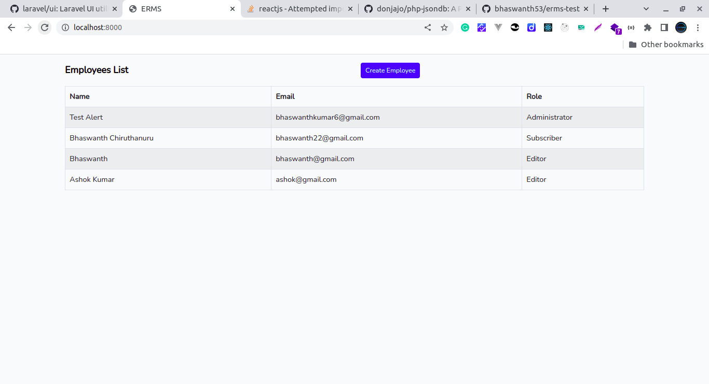
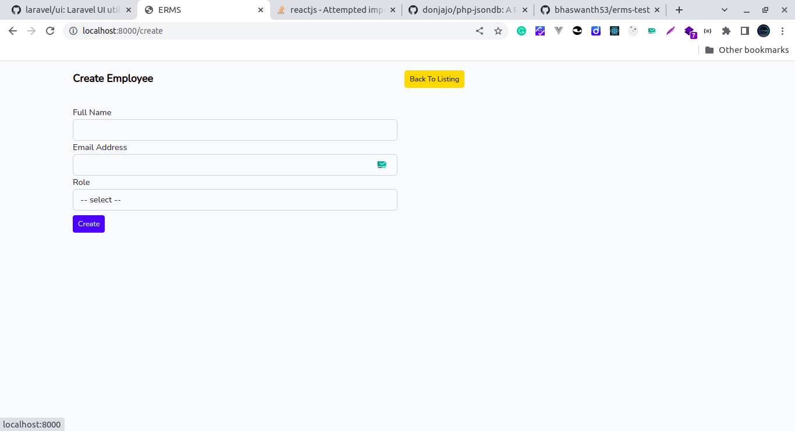

# ERMS Test

Employee Role Management System





### Installation

1. Run composer install.

```
composer install
```

2. Run node install

```
npm install
```

3. Run mix

```
npm run dev
```

4. Serve the application

```
php artisan serve
```

**Note** :

1. No need to change .env file since the application didn't use any database.

2. Laravel logs will be inside storage/logs/laravel.log

### Additional Packages Used :

1. https://github.com/donjajo/php-jsondb

As a temporary database instead of mysql.

2. https://github.com/bhaswanth53/favjs

For form validation in React.

